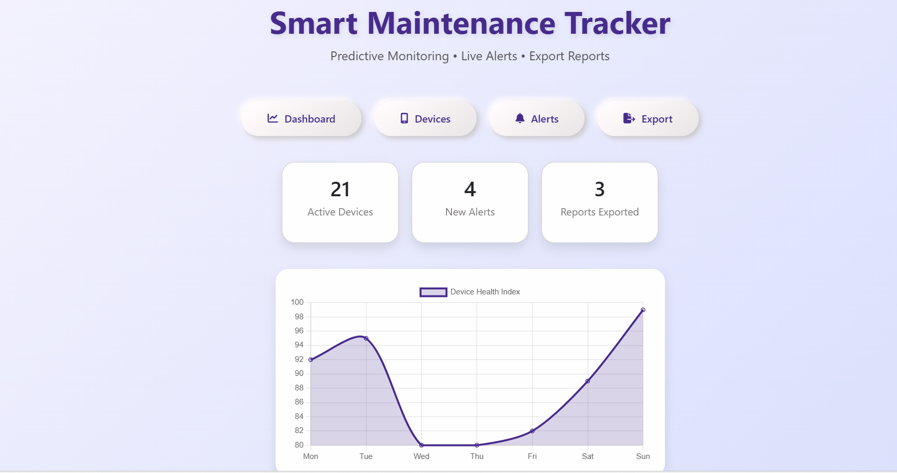
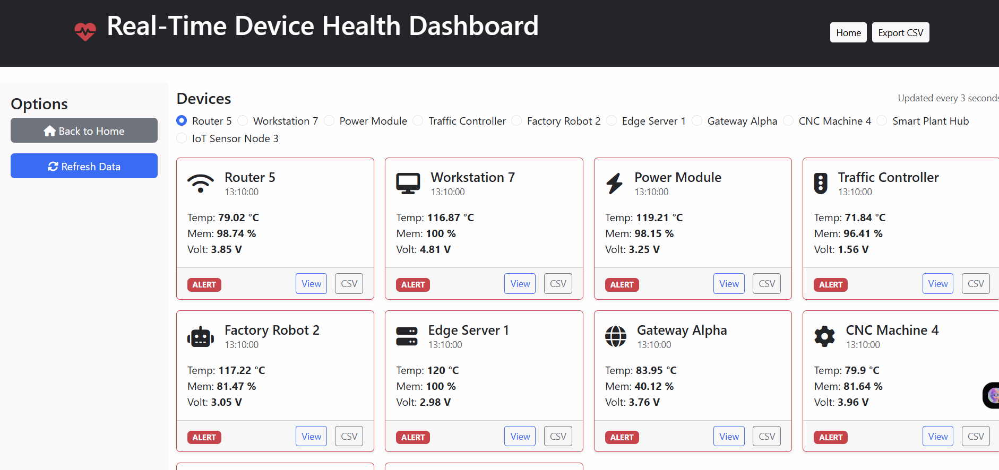
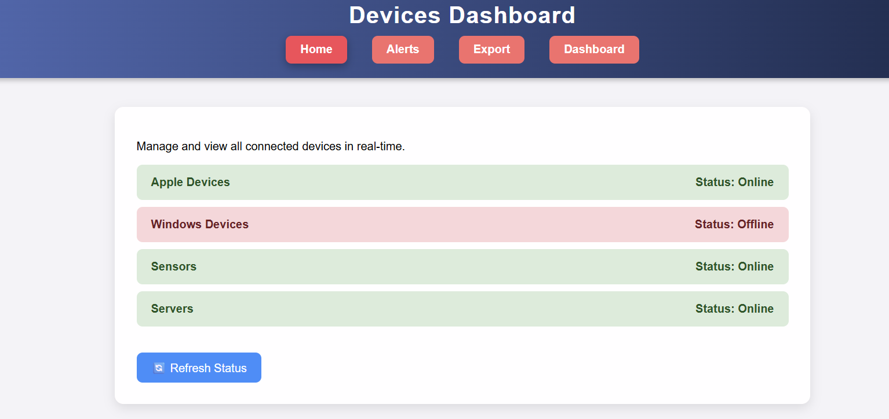
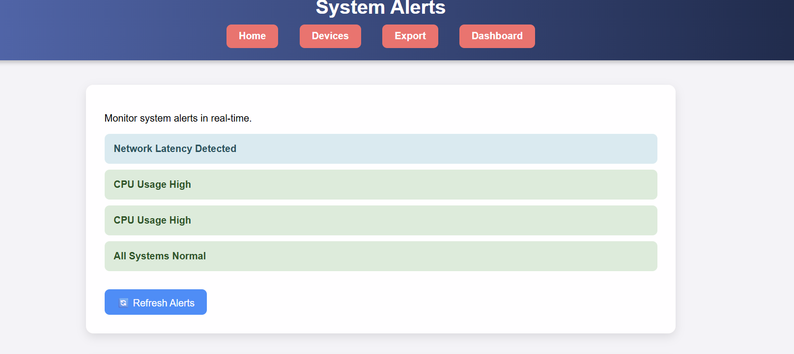
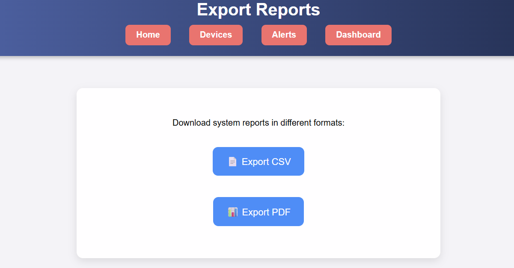

# Smart Maintenance Tracker 🚀

**Smart Maintenance Tracker** is a **real-time device monitoring and maintenance dashboard**. It provides live alerts, device management, and exportable reports with a modern interactive interface.

---

## 🌟 Features

- **Interactive Dashboard:** Live-updating charts showing device health.  
- **Devices Management:** Monitor Apple, Windows, Sensors, and Servers.  
- **Live Alerts:** Alerts  
- **Export Reports:** CSV and PDF export functionality.  
- **Responsive & Interactive:** Works on desktop and mobile 

---


## 🛠️ Tech Stack

| Layer       | Technology |
|------------|------------|
| Backend    | Spring Boot, Java |
| Frontend   | Thymeleaf, HTML5, CSS3, Bootstrap 5 |
| Charts     | Chart.js |
| Icons      | FontAwesome |
| Versioning | Git, GitHub |

---

## 📁 Project Structure

```

SmartMaintenanceTracker/
 ├── src/main/java/
 │    └── tracker/
 │         ├── SmartMaintenanceTrackerApplication.java
 │         ├── controller/
 │         │     ├── HomeController.java
 │         │     └── DeviceController.java
 │         ├── model/
 │         │     └── Device.java
 │         ├── service/
 │         │     └── DeviceService.java
 │         └── repository/
 │               └── DeviceRepository.java
 ├── src/main/resources/
 │    ├── templates/
 │    │     ├── index.html     (Home Page with Upload/Dashboard buttons)
 │    │     ├── home.html      (Upload Devices Page)
 │    │     └── dashboard.html (Device Health Dashboard with Graphs)
 │    └── application.properties
 └── pom.xml
```
---

## 🖼️ Screenshots

### Home Page


### Dashboard


### Devices Page


### Alerts Page


### Export Page


---

## 🚀 Run Locally

1. Clone repo:

```bash
git clone https://github.com/yourusername/SmartMaintenanceTracker.git
cd SmartMaintenanceTracker
````

2. Build and run:

```bash
mvn clean install
mvn spring-boot:run
```

3. Open in browser:

```
http://localhost:8083
```


> “Monitor. Maintain. Prevent. Ensure system health in real-time.”

